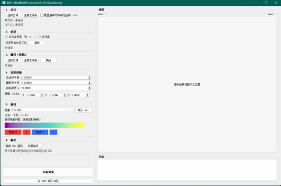

# Mitsuba Point Cloud Renderer

A lightweight Mitsuba-based point cloud renderer with single-file and batch rendering, label-based coloring, optional noise overlays, and Windows executable packaging.

<p align="center">
  
</p>

> **English version coming soon.**

## Features

- Single-file and folder batch rendering

- Labels embedded in point cloud files, with a configurable label column (default: 4th column)

- Binary and multiclass label coloring

- Optional noise point clouds, matched by filename in batch mode

- PyQt5 GUI with a loading overlay during rendering

## Requirements

- Windows 64-bit

- Python 3.8+ for development

- Dependencies: `mitsuba`, `drjit`, `numpy`, `matplotlib`, `imageio`, `OpenEXR`, `PyQt5`

## Run

```bash
conda activate softwarepack
python mistuba_tool.py
```

## Build EXE

```bash
conda activate softwarepack
pyinstaller --clean --noconfirm mistuba_tool.spec
```

Output:

```text
dist/mistuba_tool.exe
```

To run the tool on another PC, you usually only need to copy this single executable.

## Input Format

Point cloud `.txt` file:

```text
x y z
```

Or with labels:

```text
x y z label
```

Label rules:

- Binary mode: supports up to 2 distinct label values, such as `0/1`

- Multiclass mode: enable **Multiclass labels** for more than 2 classes

- Batch noise mode: noise filenames must match the corresponding clean point cloud filenames, for example `clean/a.txt` ↔ `noise/a.txt`

## Notes

- The first launch of the packaged EXE may be slower because PyInstaller extracts temporary files at startup

- NVIDIA GPUs use CUDA when available; otherwise, rendering falls back to CPU

- `build/`, `dist/`, and `__pycache__/` are ignored by `.gitignore`; do not commit build artifacts

## Acknowledgements

Built with [Mitsuba Renderer](https://www.mitsuba-renderer.org/).  
Thanks to the Mitsuba team for providing the original rendering framework.
